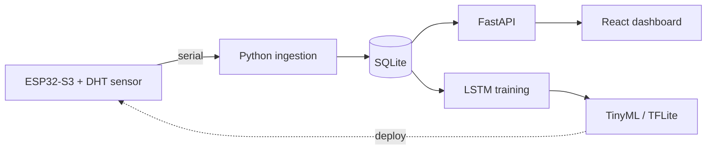

# TempCastML

> A TinyML-powered system that predicts indoor room-temperature trends from
> real-time sensor data — collected on an **ESP32-S3**, forecast with an **LSTM**,
> and visualized through a live telemetry dashboard.

<p align="left">
  
  
  
  
  
  
</p>


<sub>Screenshots shown with representative sample data.</sub>

---

## Overview

TempCastML is an end-to-end edge-ML project. A microcontroller reads indoor
conditions, a Python service ingests and stores them, an LSTM learns the
temperature time series to forecast the next 24 hours, and a React dashboard
makes the live data, trends, and predictions glanceable. The trained model is
then compressed for **on-device (TinyML) inference** back on the ESP32-S3 — no
cloud required.



## Screenshots

| Dashboard | History |
| --- | --- |
|  |  |

| About | Mobile |
| --- | --- |
|  |  |

The frontend is a bespoke dark "telemetry command center": animated live
readout, backend connection + data-freshness indicators, a thermal-gradient
forecast chart, unit (°C/°F/K) and 12/24h toggles, and honest loading / empty /
offline states.

## Tech stack

| Layer | Technology |
| --- | --- |
| Hardware | ESP32-S3, DHT temperature/humidity sensor, Arduino (C++) |
| Ingestion | Python serial collector + cleaning pipeline |
| Backend / API | FastAPI, SQLModel, SQLite, SlowAPI (rate limiting) |
| Machine learning | TensorFlow / Keras LSTM → TinyML (TFLite) |
| Frontend | React 19, Vite 7, Recharts, React Router |

## API

Base URL: `http://localhost:8000`

| Method | Endpoint | Description |
| --- | --- | --- |
| `GET` | `/` | Health / welcome message |
| `GET` | `/sensor/latest` | Most recent reading |
| `GET` | `/sensor/history?limit=N` | Recent readings (newest first) |
| `GET` | `/predict/?device_id=1&horizon=24` | LSTM temperature forecast |
| `POST`| `/sensor/` | Ingest a `{ device_id, temperature_c }` reading |

A `Reading` is `{ id, device_id, temperature_c, timestamp }`.

## Getting started

### Prerequisites

- **Node.js** 18+ (developed on 22) and npm
- **Python** 3.10+
- *(Optional)* an ESP32-S3 with a DHT sensor for real data collection

### 1. Backend

```bash
cd backend
python3 -m venv venv
source venv/bin/activate        # Windows: venv\Scripts\activate
pip install -r requirements.txt
cd ..
uvicorn backend.main:app --reload
```

The API starts on `http://localhost:8000`. Tables are created automatically on
startup; ingest some readings (via the ESP32 collector or the `POST /sensor/`
endpoint) so the dashboard has data to show.

### 2. Frontend

```bash
cd frontend
npm install
npm run dev
```

The dashboard starts on `http://localhost:5173` and talks to the backend on
port 8000. To point it elsewhere, set `VITE_API_URL` (e.g. in `frontend/.env`).

### 3. Environment

Copy `.env.example` to `.env` and fill in:

- `SERIAL_PORT` — the serial port your ESP32/Arduino is on (e.g. `COM4`, `/dev/ttyUSB0`)
- `API_KEY` — an OpenWeatherMap key (used to enrich readings with outdoor data)

> CORS is preconfigured for `http://localhost:5173`. If you run the frontend on
> another origin, update `origins` in `backend/main.py`.

## Project structure

```
TempCastML/
├── backend/              FastAPI app, ingestion, database, AI
│   ├── Routes/           sensor + prediction endpoints
│   ├── Database/         SQLModel models + engine
│   ├── Ingestion/        serial collection + cleaning
│   ├── AI/               LSTM training + inference
│   └── main.py
├── frontend/             React + Vite dashboard
│   └── src/
│       ├── components/    UI building blocks
│       ├── pages/         Dashboard, History, About
│       ├── services/      API client
│       ├── hooks/         small reusable hooks
│       ├── lib/           formatting helpers
│       └── index.css      design system (tokens + components)
├── low-level code/       ESP32-S3 firmware (.ino)
├── instructions/         setup + run guides
└── screenshots/          README imagery
```

### Frontend scripts

```bash
npm run dev       # start dev server
npm run build     # production build
npm run preview   # serve the production build
npm run lint      # eslint
```

## Roadmap

- [x] Sensor ingestion and timestamped storage
- [x] FastAPI endpoints for latest / history / forecast
- [x] LSTM training pipeline and forecast API
- [x] Redesigned, ship-ready dashboard
- [ ] Surface humidity / pressure once the sensor contract exposes them
- [ ] TinyML (TFLite) deployment of the trained model onto the ESP32-S3

## Team

- **Hung Lee** — Lead · embedded & low-level engineering (circuits, firmware, on-device TinyML)
- **Hung Anh** — Frontend engineering (dashboard, data visualization, UX)

## License

No license has been specified yet — please contact the authors before reuse.
