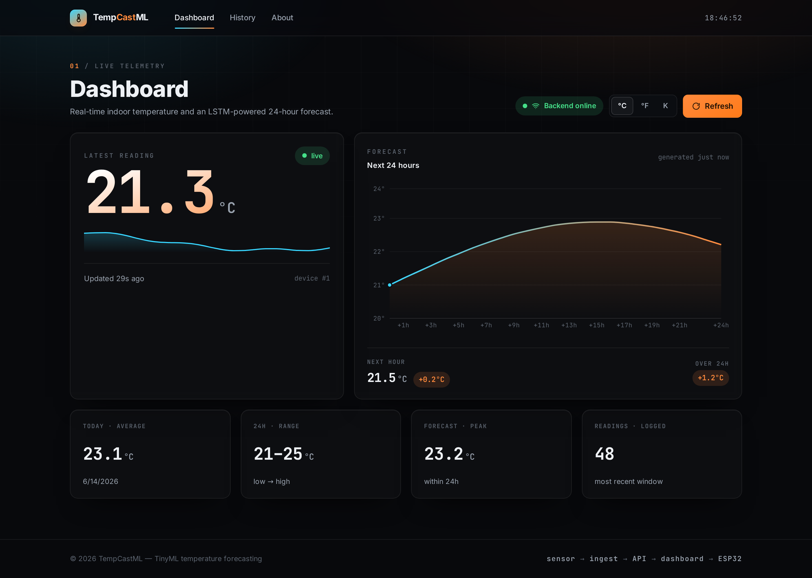
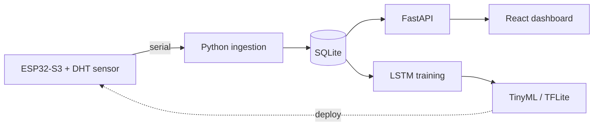
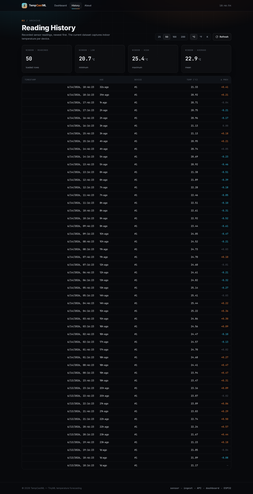
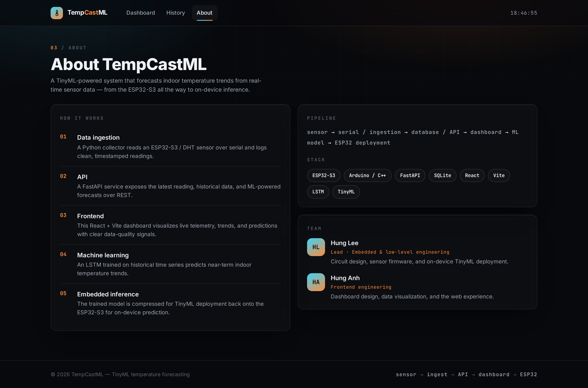
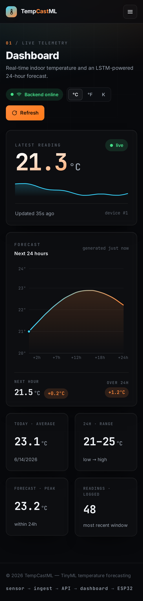
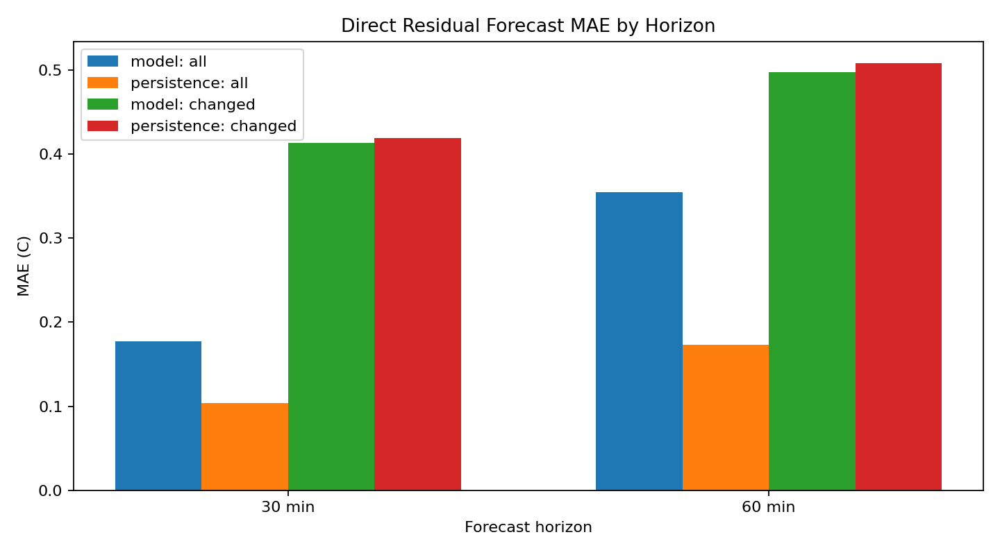

# TempCastML

> A TinyML-powered system that predicts indoor room-temperature trends from
> real-time sensor data — collected on an **ESP32-S3**, forecast with an **LSTM**,
> and visualized through a live telemetry dashboard.

<p align="left">
  
  
  
  
  
  
</p>



<sub>Screenshots shown with representative sample data.</sub>

---

## Overview

TempCastML is an end-to-end edge-ML research project. A microcontroller reads
indoor conditions, a Python service ingests and stores them, reproducible model
experiments evaluate short-term temperature forecasts, and a React dashboard
makes the live data, trends, and predictions glanceable.

TinyML deployment on the ESP32-S3 is the target, but model export is intentionally
blocked until a trained model clearly beats the persistence baseline across
multiple chronological test windows.



## Screenshots

| Dashboard | History |
| --- | --- |
|  |  |

| About | Mobile |
| --- | --- |
|  |  |

The frontend is a bespoke dark "telemetry command center": animated live
readout, backend connection + data-freshness indicators, a thermal-gradient
forecast chart, unit (°C/°F/K) and 12/24h toggles, and honest loading / empty /
offline states.

## Tech stack

| Layer | Technology |
| --- | --- |
| Hardware | ESP32-S3, DHT temperature/humidity sensor, Arduino (C++) |
| Ingestion | Python serial collector + cleaning pipeline |
| Backend / API | FastAPI, SQLModel, SQLite, SlowAPI (rate limiting) |
| Machine learning | TensorFlow / Keras LSTM → TinyML (TFLite) |
| Frontend | React 19, Vite 7, Recharts, React Router |

## AI and model evaluation

The current ML workflow uses `backend/Data/merged_data.csv` and enforces:

- Chronological train, validation, and test splits.
- Training-only normalization.
- Sequence rejection across large collection gaps.
- Fixed, reproducible training configuration.
- MAE, RMSE, and R² evaluation against persistence baselines.
- Exported predictions, metrics, loss curves, and diagnostic charts.

Two model paths are available:

| Trainer | Purpose |
| --- | --- |
| `backend.AI.train_lstm` | One-step, temperature-only LSTM baseline |
| `backend.AI.train_residual_lstm` | Direct multivariate residual forecasts using indoor/outdoor conditions and cyclical time features |

### Current results

The direct residual model slightly improves forecasts when temperature actually
changes, but persistence remains better across the full test set because most
short-horizon readings are unchanged.

| Horizon | Residual LSTM MAE | Persistence MAE | Changed-event LSTM MAE | Changed-event persistence MAE |
| --- | ---: | ---: | ---: | ---: |
| 30 minutes | 0.177 °C | 0.104 °C | 0.413 °C | 0.419 °C |
| 60 minutes | 0.354 °C | 0.173 °C | 0.497 °C | 0.509 °C |



The main problems are a strong persistence baseline, positive prediction bias
on the colder test period, limited temporal coverage, sensor quantization, and
missing context such as occupancy or HVAC state.

See [the full AI/ML analysis](backend/AI/ML_ANALYSIS.md) and
[exported reports](backend/AI/Reports/) for findings, charts, raw test
predictions, and the next experiment plan.

### Train and evaluate

Run commands from the repository root after installing
`backend/requirements.txt`:

```bash
# Focused AI tests
python3 -m pytest backend/AI/tests

# One-step temperature-only baseline
python3 -m backend.AI.train_lstm

# Direct 30-minute residual experiment
python3 -m backend.AI.train_residual_lstm \
  --forecast-horizon 3 \
  --model-output-dir backend/AI/Model/residual_30min \
  --report-output-dir backend/AI/Reports/residual_30min

# Direct 60-minute residual experiment
python3 -m backend.AI.train_residual_lstm \
  --forecast-horizon 6 \
  --model-output-dir backend/AI/Model/residual_60min \
  --report-output-dir backend/AI/Reports/residual_60min
```

## API

Base URL: `http://localhost:8000`

| Method | Endpoint | Description |
| --- | --- | --- |
| `GET` | `/` | Health / welcome message |
| `GET` | `/sensor/latest` | Most recent reading |
| `GET` | `/sensor/history?limit=N` | Recent readings (newest first) |
| `GET` | `/predict/?device_id=1&horizon=24` | LSTM temperature forecast |
| `POST`| `/sensor/` | Ingest a `{ device_id, temperature_c }` reading |

A `Reading` is `{ id, device_id, temperature_c, timestamp }`.

## Getting started

### Prerequisites

- **Node.js** 18+ (developed on 22) and npm
- **Python** 3.10+
- *(Optional)* an ESP32-S3 with a DHT sensor for real data collection

### 1. Backend

```bash
cd backend
python3 -m venv venv
source venv/bin/activate        # Windows: venv\Scripts\activate
pip install -r requirements.txt
cd ..
uvicorn backend.main:app --reload
```

The API starts on `http://localhost:8000`. Tables are created automatically on
startup; ingest some readings (via the ESP32 collector or the `POST /sensor/`
endpoint) so the dashboard has data to show.

### 2. Frontend

```bash
cd frontend
npm install
npm run dev
```

The dashboard starts on `http://localhost:5173` and talks to the backend on
port 8000. To point it elsewhere, set `VITE_API_URL` (e.g. in `frontend/.env`).

### 3. Environment

Copy `.env.example` to `.env` and fill in:

- `SERIAL_PORT` — the serial port your ESP32/Arduino is on (e.g. `COM4`, `/dev/ttyUSB0`)
- `API_KEY` — an OpenWeatherMap key (used to enrich readings with outdoor data)

> CORS is preconfigured for `http://localhost:5173`. If you run the frontend on
> another origin, update `origins` in `backend/main.py`.

## Project structure

```
TempCastML/
├── backend/              FastAPI app, ingestion, database, AI
│   ├── Routes/           sensor + prediction endpoints
│   ├── Database/         SQLModel models + engine
│   ├── Ingestion/        serial collection + cleaning
│   ├── AI/               training, evaluation reports + inference
│   └── main.py
├── frontend/             React + Vite dashboard
│   └── src/
│       ├── components/    UI building blocks
│       ├── pages/         Dashboard, History, About
│       ├── services/      API client
│       ├── hooks/         small reusable hooks
│       ├── lib/           formatting helpers
│       └── index.css      design system (tokens + components)
├── low-level code/       ESP32-S3 firmware (.ino)
├── instructions/         setup + run guides
└── screenshots/          README imagery
```

### Frontend scripts

```bash
npm run dev       # start dev server
npm run build     # production build
npm run preview   # serve the production build
npm run lint      # eslint
```

## Roadmap

- [x] Sensor ingestion and timestamped storage
- [x] FastAPI endpoints for latest / history / forecast
- [x] Reproducible LSTM and residual-model evaluation pipelines
- [x] Exported AI metrics, predictions, charts, and analysis
- [x] Redesigned, ship-ready dashboard
- [ ] Beat persistence across chronological test windows
- [ ] Add change-detection and gated residual forecasting
- [ ] Surface humidity / pressure once the sensor contract exposes them
- [ ] TinyML deployment after model quality gates pass

## Team

- **Hung Lee** — Lead · embedded & low-level engineering (circuits, firmware, on-device TinyML)
- **Hung Anh** — Frontend engineering (dashboard, data visualization, UX)

## License

No license has been specified yet — please contact the authors before reuse.
